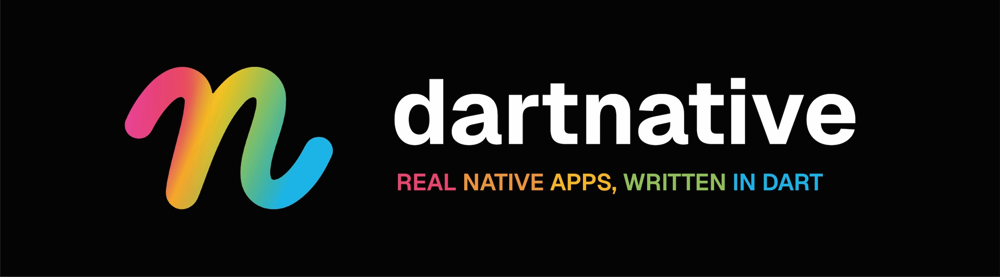

<p align="center">
  
</p>

# DartNative

DartNative is a framework for building iOS and Android applications using Dart — with real, native platform UI instead of a custom rendering engine.

Your Dart code drives UIKit on iOS and the Android View system on Android directly, through synchronous FFI calls on the main thread. There is no JavaScript bridge, no custom rendering engine abstracting system components, no thread hops. What you ship is a native app that happens to be written in Dart: AOT-compiled, full speed from the first frame, the platform's own look and feel, and no custom renderer between your code and the screen.

---

## See it in action

https://github.com/user-attachments/assets/6e472fc2-25c6-4718-9e75-dd490569e4a5

All features available at [dartnative.com](https://dartnative.com/).

---

**About this repo** — everything public lives here: the [docs](docs/), the
[playground](playground/) demo app, twenty-plus runnable
[tutorials](tutorials/), an example for every [plugin](plugins/), and the
issue tracker. The framework itself is developed in private repositories, so
the commits you see here are releases, not day-to-day work. DartNative ships
continuously — fixes arrive in days, not months. To update, re-run the
install command.

---

## The work behind it

**Half a million lines of original code**, already used in production — with
34 first-party plugins, all free, every one backed by the platform's own APIs.

| 527k | 3,900 | 40 | 100% |
|:---:|:---:|:---:|:---:|
| lines of original code | commits | repositories | of plugins always free |

*Counts are original code only — generated and imported code excluded.
The detailed breakdown behind these numbers — and what ships week by week —
is on the [changelog](https://dartnative.com/changelog/).*

**Used in production:**

- **Gee** — a voice-first AI companion · [App Store](https://apps.apple.com/app/id6760962082) · [Google Play](https://play.google.com/store/apps/details?id=com.withgee.app)
- **Presence Messenger** — porting to DartNative · [App Store](https://apps.apple.com/app/presence-messenger/id6504456930) · [Google Play](https://play.google.com/store/apps/details?id=is.presence.app)

---

## Why DartNative

Flutter proved that a single codebase for mobile could be productive for cross-platform development. But it achieves that by replacing the platform UI stack with its own rendering engine — Impeller / Skia — repainting every pixel of your interface every frame. That design prioritizes multi-platform, pixel-perfect consistency over integration, detaching your app from the operating system it runs on.

**The tradeoff is structural, not cosmetic:**
- Native controls are replaced by simulated widgets
- Text rendering differs from the platform
- Scrolling physics feel approximate
- Gestures need translation layers
- Accessibility and platform behavior require extra work
- UI looks close to native, but never truly native — because it isn’t

Users notice this. Apps can feel off — in scrolling, in touch response, in typography, in text input, in subtle interactions. For some products, that compromise is acceptable. For premium apps where polish, trust, and platform fidelity matter, it becomes a serious limitation.

React Native moves closer to the platform by using real native views, but introduces a different constraint: every meaningful update depends on coordination with a JavaScript runtime running in a separate execution context. Even with the New Architecture (JSI + Fabric), the JS runtime remains a separate context — gesture handling, state updates, and layout decisions still originate outside the main thread and require synchronization before reaching native views. For standard apps this can be acceptable, but for highly interactive, animation-heavy, or performance-critical products, the overhead becomes a real ceiling.

DartNative takes a different approach:

- **Real native views.** UILabel, UITextField, UIScrollView, UITableView — not redrawn pixels.
- **Single thread.** All Dart code runs on the platform's main thread. setState → diff → UIKit in one synchronous call stack. Zero thread hops.
- **Dart AOT.** No JIT. No warmup. No GC pauses from recompilation. Full speed from first frame.
- **Flutter-compatible API.** Column, Row, Text, Container, ListView, Navigator — if you know Flutter, you already know this framework. Most code compiles with zero changes.

---

## How It Works

```
┌────────────────────────────────┐
│    Your Dart code              │  setState(), widgets, state
├────────────────────────────────┤
│    Reconciler                  │  diffs the widget tree into view changes
├────────────────────────────────┤
│    Platform Bindings           │  FFI on iOS · FFI → JNI on Android
├────────────────────────────────┤
│    UIKit / Android Views       │  real native controls
└────────────────────────────────┘
        ▲ all layers run on the platform main thread
```

When you call `setState()`, the reconciler computes exactly what changed and applies it to the real native views in a single call per frame. Layout runs, the frame commits, and it is all done before the next vsync.

No async. No dispatch. No queue. Same thread, start to finish.

For a detailed walkthrough of the architecture, see [docs/architecture.md](docs/architecture.md).

---

## Runtime Foundations

DartNative runs on **Zero**, our fork of [flutter_zero](https://github.com/knopp/flutter_zero) by Matej Knopp: the Flutter engine with its rendering stack removed and Dart running on the platform's main thread instead of a background isolate. What remains is the Dart VM in AOT mode, `dart:ffi`, and the Flutter toolchain. DartNative builds its widgets and platform bindings on that foundation.

DartNative CodePush is also built into Zero: `dn release` ships a build, and `dn patch` sends a Dart fix through the [dartpub.dev](https://dartpub.dev) server to apps that are already installed, picked up on the next launch. It works the same on iOS and Android. The service is still experimental and not open to the public yet — write to dev@dartnative.com to hear when it opens up.

None of this would exist without the [Dart team at Google](https://dart.dev) — the language, the AOT compiler, the FFI layer, and the tooling that makes all of this work are their foundation. Dart's AOT mode eliminates JIT warmup and GC pauses from recompilation, and its `dart:ffi` layer makes the synchronous native bridge possible with essentially zero overhead per call.

The `dn` CLI is the developer-facing surface: it wraps the `flutter` tool, points it at Zero's engine artifacts, and downloads them automatically on first run. From a developer's perspective it is a drop-in replacement — `dn run`, `dn build`, `dn pub get` all work exactly as you would expect from Flutter.

Layout on both platforms is powered by [Yoga](https://www.yogalayout.dev) (Meta), the CSS Flexbox engine that computes all view frames.

We also want to acknowledge the work of the Flutter and React Native teams — their years of pushing cross-platform development forward shaped the landscape that made an approach like DartNative worth building.

DartNative is an independent product of Presence Network Inc.

---

## Platform Status

| Platform | Status | Layout engine | List recycling | GPU canvas |
|---|---|---|---|---|
| iOS | Production-ready | Yoga | UITableView / UICollectionView | Skia Graphite + Metal |
| Android | Production-ready | Yoga + Android Views | RecyclerView | Skia Graphite + Vulkan |

---

## Widget Coverage

DartNative ships a broad widget set designed to be source-compatible with Flutter. If you're migrating from Flutter, most of your widget code works as-is.

Key widgets available today:

- **Layout:** `Column`, `Row`, `Stack`, `Flex`, `Expanded`, `Padding`, `Container`, `SizedBox`, `SafeArea`, `Wrap`, `LayoutBuilder`, and more
- **Text & Input:** `Text`, `RichText`, `TextField`
- **Images:** `Image`, `NetworkImage`, `AssetImage`, `MemoryImage`, `FileImage`
- **Scrolling & Grids:** `ListView`, `ListView.builder`, `SingleChildScrollView`, `CustomScrollView`, `GridView`, slivers — plus `FastList`, `FastGrid`, and `MasonryFastGrid` for high-performance virtualized lists
- **Navigation:** `Navigator`, `App`, `Scaffold`, `AppBar`, `BottomNavigationBar`, `Drawer`, `showModalBottomSheet`
- **Controls:** `Button` (covers Flutter's ElevatedButton, TextButton, FilledButton, OutlinedButton), `Checkbox`, `Radio`, `Switch`, `Slider`, `SegmentedControl`, `Icon`, `IconButton`
- **Gestures:** `GestureDetector`, `InkWell`, `Listener` — all firing synchronously on the main thread
- **Animation:** `AnimationController`, `AnimatedOpacity`, `AnimatedBuilder`, `TweenAnimationBuilder`, `SlideTransition`, `SizeTransition`, `RotationTransition`
- **Async:** `FutureBuilder`, `StreamBuilder`, `ValueListenableBuilder`
- **Native platform UI:** `showAlert` (UIAlertController), `showDatePicker` (UIDatePicker), `showMediaPicker` (system photo picker, via `dartnative_media_picker`) — real system UI, not simulated dialogs
- **Custom canvas:** `CanvasSurface` — GPU-accelerated custom drawing and shader effects, via [`dartnative_skia`](docs/skia.md); `CustomPaint` for CPU-side 2D drawing

Full reference: [docs/widgets.md](docs/widgets.md) · Canvas & shaders: [docs/skia.md](docs/skia.md)

---

## State Management

DartNative ships a reactive state model built around three primitives — `signal<T>()`, `computed()`, and `effect()` — with a `.watch(context)` extension that subscribes any `StatelessWidget` or `StatefulWidget` directly. No `ChangeNotifier` subclass required, no `Consumer` widget, no scope, no registry.

```dart
final counter = signal<int>(0);

Widget build(BuildContext context) {
  final count = counter.watch(context);   // subscribes, rebuilds on change
  return Text('$count');
}
```

Existing `ChangeNotifier` / `ValueNotifier` classes bridge in with the same `.watch(context)` call — no migration required. Per-subtree dependency injection is available via `Provided<T>` when you need separate instances for different subtrees.

Full guide: [docs/state_management.md](docs/state_management.md)

---

## Storage

Storage is provided by focused first-party plugins on [dartpub.dev](https://dartpub.dev), each a drop-in for the Flutter package you already know — backed by Dart FFI, no MethodChannel, usable from any isolate.

| Plugin | Drop-in for | Entry point |
|---|---|---|
| `dartnative_shared_preferences` | `shared_preferences` | `SharedPreferences.getInstance()` |
| `dartnative_secure_storage` | `flutter_secure_storage` | `SecureStorage()` |
| `dartnative_hive` | `hive` | `Hive.initDartNative()` / `Hive.openBox()` |
| `dartnative_sqlite` | `sqflite` | `Sqlite.open()` |
| `dartnative_path_provider` | `path_provider` | `getApplicationDocumentsDirectory()` (sync) |

```dart
// Preferences — the shared_preferences API
final prefs = await SharedPreferences.getInstance();
await prefs.setString('theme', 'dark');

// Secure storage — the flutter_secure_storage API
final storage = SecureStorage();
await storage.write(key: 'auth_token', value: token);

// Hive — the usual Hive API (path is a sync String)
Hive.initDartNative(getApplicationDocumentsDirectory());
final box = await Hive.openBox('settings');
await box.put('launch_count', (box.get('launch_count') ?? 0) + 1);

// SQLite — sqflite-style
Sqlite.ensureInitialized();
final db = await Sqlite.open('${getApplicationDocumentsDirectory()}/app.db');
final rows = await db.rawQuery('SELECT * FROM messages ORDER BY ts DESC');
```

Works from any Dart isolate — FFI calls need no platform-channel registration.

---

## Debugging & Logging

### One terminal. Every log. Zero config.

DartNative's unified log system bridges the gap between your Dart code and native UIKit callbacks — all visible in the same `dn run` terminal, without switching to Xcode.

Native `dnLog` lines land in the same stream as your Dart `print()` calls — no configuration. Every `UIScrollViewDelegate` callback, every `UIGestureRecognizer` action, every `UITextField` delegate method appears right alongside your Dart logs, in real time.

```dart
// Swift side — any callback, any thread:
dnLog("gesture state = \(state.rawValue)")

// Appears in your VS Code terminal, inline with Dart print():
// [dn] gesture state = 3
// [dart] ChatScreen.build() — messages.length = 42
```

### Beyond the terminal: structured logging with file persistence

`DartNativeLogger` adds file persistence for CI and field debugging, and a verbose mode for deep diagnostics:

```dart
DartNativeLogger.run(
  () => runApp(const MyApp()),
  verbose: true,
  saveToFile: true, // every Dart and native line, kept in the app's sandbox — ideal for TestFlight builds
);
```

One window, one workflow, every log — whether it originated in Dart or UIKit.

Full reference: [docs/logging.md](docs/logging.md)

---

## The Playground

The [`playground/`](playground/) folder is a runnable demo app — the fastest way to feel the difference. Load it on a **device, not a simulator**, and go through the screens; the gap from Flutter and React Native is not subtle.

The screens are grouped into five tabs:

- **Showcase** — complete example screens that combine many widgets end to end.
- **Widgets** — the core toolkit, each control rendered as its real native view: text, text fields, lists and grids, stacks, hit-testing, and state.
- **Graphics** — the Skia `CanvasSurface` (direct Metal on iOS, Vulkan on Android), `CustomPaint`, and Lottie.
- **Media** — video with disk caching and HLS streaming, plus camera, audio, and text-to-speech.
- **System** — storage, push notifications, social sign-in, connectivity, and other device APIs.

Because every screen drives real UIKit and Android views, the details are correct by default — 120 Hz keyboard tracking, haptics, Dark Mode, Dynamic Type, the system tap highlight — with nothing to configure.

### Run on device

```bash
cd playground
dn pub get
dn run
```

No account or key needed — the playground is an official demo, free to run.
`dn` is the DartNative CLI; see
[docs/getting_started.md](docs/getting_started.md) to install it.

---

## Built for the Apps Where Good Enough Isn't

Developers on Flutter and React Native have shipped great work. They have also spent years navigating the same classes of limitation — keyboard animation that stutters, navigation transitions that approximate the platform curve, scroll physics that feel close but not exact, text input that behaves almost like native, performance issues that require complex workarounds.

These are not bugs waiting to be fixed. They are architectural consequences.

DartNative removes the indirection. Your widget tree drives real UIKit and Android Views, on the main thread, with no custom renderer between your code and the screen. The performance headroom is not DartNative's — it belongs to the platform and was always there.

For teams building products where interaction quality is part of the value — where users will notice the difference, and where "close to native" is not the standard — DartNative is the shortest path from Dart code to that quality level.

Load the playground on a device. Scroll a long list, push a screen, type in a text field. Then read [the architecture](docs/architecture.md) to understand why it works this way.

[Get started →](docs/getting_started.md)

The getting started guide also covers **migrating an existing Flutter app** to DartNative. Most code is unchanged — the guide lists the small set of adjustments required and includes step-by-step instructions for Claude (or any LLM) to perform the conversion automatically. If you are already working with Claude, you can paste your project files and ask it to migrate them: it knows the full widget API and will handle the conversion in one pass.

---

## License

See [LICENSE](LICENSE).
