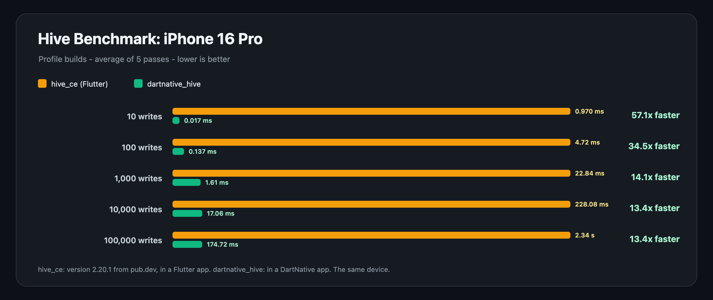
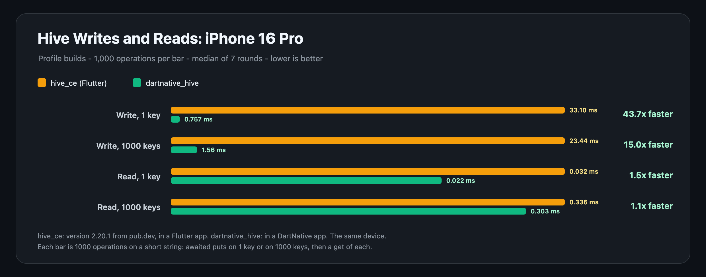

# Benchmark

hive_ce in a Flutter app against dartnative_hive in a DartNative app, on
the same iPhone 16 Pro (iOS 26), both profile builds. Two benchmarks:

- **hive_ce's own benchmark**, as hive_ce publishes it
  (`benchmarks/storage` in its repository): awaited `box.add` calls of a
  ten-field object into a fresh box, five passes, the average time and the
  size of the file. Writes only, as in hive_ce's table.
- **Writes and reads**: a write and a read of a short string, on 1 key
  and on 1000 keys, 1000 operations each, median of seven rounds. Every
  other value type and way of writing is in a folded table below it.

How each side runs:

- **dartnative_hive**: this example, `dn run --profile -t
  lib/benchmark_main.dart`. It runs every benchmark twice, on the default
  memory-mapped backend and with `mmap: false` (a write call per change,
  as hive_ce writes); both columns are in the tables.
- **hive_ce, Flutter**: a new `flutter create` app with `hive_ce: 2.20.1`
  (the version dartnative_hive ports), the files of `lib/benchmark/`
  copied in with two lines changed (the import,
  `package:hive_ce/hive_ce.dart`, and `Hive.init(root.path)`), and
  `flutter run --profile`. It ran twice, and its column is the better of
  the two runs for each row, the one that favours hive_ce.

## hive_ce's benchmark



| Writes | hive_ce, Flutter (ms) | dartnative_hive (ms) | dartnative_hive | mmap: false (ms) | Size (MB) |
| ---: | ---: | ---: | ---: | ---: | ---: |
| 10 | 0.970 | 0.017 | 57.1x faster | 0.996 | 0.00 |
| 100 | 4.722 | 0.137 | 34.5x faster | 4.129 | 0.01 |
| 1000 | 22.837 | 1.615 | 14.1x faster | 23.707 | 0.11 |
| 10000 | 228.079 | 17.056 | 13.4x faster | 229.985 | 1.10 |
| 100000 | 2343.775 | 174.715 | 13.4x faster | 2467.353 | 10.97 |

Both write the same file format, so the files are the same size. The
iPhone runs up to 100,000 writes: hive_ce's table goes to a million, which
takes minutes per pass on a phone.

## Writes and reads



Milliseconds for 1000 operations on a short string; lower is better.

| Operation | hive_ce, Flutter (ms) | dartnative_hive (ms) | dartnative_hive |
| --- | ---: | ---: | ---: |
| Write, 1 key | 33.097 | 0.757 | 43.7x faster |
| Write, 1000 keys | 23.439 | 1.564 | 15.0x faster |
| Read, 1 key | 0.032 | 0.022 | 1.5x faster |
| Read, 1000 keys | 0.336 | 0.303 | 1.1x faster |

- **Write, 1 key**: 1000 awaited `put` calls on the same key, each safe
  from the app being killed when it returns. hive_ce compacts the box into
  a new file after every 61 overwrites; dartnative_hive compacts only when
  its file is full.
- **Write, 1000 keys**: the same loop on 1000 new keys. Each new key is
  also an insert into Hive's sorted index, in both.
- **Read**: a `get` of each key, a lookup in memory in both, the same
  code. The one-key rows differ by about 10 microseconds per 1000 reads,
  which is within a run's noise.

A write survives the app being killed. To survive a power cut as well, it
must reach the flash chip: `box.flush()` does that.

<details>
<summary>Every case: integers, booleans, 256-byte buffers, puts not awaited, one <code>putAll</code></summary>

| Case | hive_ce, Flutter (ms) | dartnative_hive (ms) | dartnative_hive | mmap: false (ms) |
| --- | ---: | ---: | ---: | ---: |
| **Stored writes** | | | | |
| string, every put awaited | 33.097 | 0.757 | 43.7x faster | 33.962 |
| string, every put awaited, 1000 keys | 23.439 | 1.564 | 15.0x faster | 24.413 |
| string, 1000 puts, last awaited | 23.134 | 0.793 | 29.2x faster | 24.298 |
| string, one putAll | 0.945 | 0.883 | 1.07x faster | 1.005 |
| integer, every put awaited | 33.295 | 0.678 | 49.1x faster | 34.332 |
| integer, every put awaited, 1000 keys | 23.501 | 1.264 | 18.6x faster | 24.770 |
| integer, 1000 puts, last awaited | 22.972 | 0.634 | 36.2x faster | 24.179 |
| integer, one putAll | 0.771 | 0.768 | 1.00x faster | 0.820 |
| boolean, every put awaited | 33.504 | 0.725 | 46.2x faster | 34.203 |
| boolean, every put awaited, 1000 keys | 23.691 | 1.183 | 20.0x faster | 24.692 |
| boolean, 1000 puts, last awaited | 22.873 | 0.644 | 35.5x faster | 24.662 |
| boolean, one putAll | 0.745 | 0.741 | 1.01x faster | 0.793 |
| buffer 256B, every put awaited | 35.157 | 3.080 | 11.4x faster | 36.292 |
| buffer 256B, every put awaited, 1000 keys | 24.583 | 2.112 | 11.6x faster | 25.660 |
| buffer 256B, 1000 puts, last awaited | 24.078 | 1.527 | 15.8x faster | 25.283 |
| buffer 256B, one putAll | 1.956 | 1.712 | 1.1x faster | 1.942 |
| **Writes not awaited** | | | | |
| string, put not awaited | 0.260 | 0.644 |  | 0.266 |
| string, put not awaited, 1000 keys | 0.811 | 1.194 |  | 0.836 |
| integer, put not awaited | 0.259 | 0.487 |  | 0.267 |
| integer, put not awaited, 1000 keys | 0.803 | 1.033 |  | 0.846 |
| boolean, put not awaited | 0.255 | 0.495 |  | 0.275 |
| boolean, put not awaited, 1000 keys | 0.812 | 1.138 |  | 0.872 |
| buffer 256B, put not awaited | 0.252 | 1.494 |  | 0.269 |
| buffer 256B, put not awaited, 1000 keys | 0.795 | 1.882 |  | 0.807 |
| **Reads** | | | | |
| string read | 0.032 | 0.022 | 1.5x faster | 0.035 |
| string read, 1000 keys | 0.336 | 0.303 | 1.1x faster | 0.320 |
| integer read | 0.032 | 0.023 | 1.4x faster | 0.034 |
| integer read, 1000 keys | 0.323 | 0.328 | 1.02x slower | 0.354 |
| boolean read | 0.024 | 0.025 | 1.04x slower | 0.034 |
| boolean read, 1000 keys | 0.331 | 0.317 | 1.04x faster | 0.329 |
| buffer 256B read | 0.035 | 0.029 | 1.2x faster | 0.029 |
| buffer 256B read, 1000 keys | 0.314 | 0.321 | 1.02x slower | 0.321 |

**Stored writes** stop the clock once every change is stored.
`1000 puts, last awaited` awaits only the last future; `one putAll`
stores 1000 keys in a single write in both, so the two are close.

**Writes not awaited** never wait for the future. In hive_ce nothing is
stored when the clock stops, so its row is the cost of updating Hive's
memory. In dartnative_hive every `put` has already stored its value, so
its row is the whole write, and an app that does not await its puts loses
nothing when it is killed. The two rows do different work, so they get no
ratio.

The 256-byte one-key rows write past the first 64 KiB of the file, so
dartnative_hive grows or compacts it on the way, which the smaller values
never reach.

</details>

## Redrawing the charts

The charts are drawn from the tables above, so they cannot drift from the
numbers:

```
dart run tool/generate_benchmark_chart.dart hive-ce benchmarks/README.md \
  benchmarks/hive_ce_benchmark.svg "iPhone 16 Pro"
dart run tool/generate_benchmark_chart.dart writes-and-reads \
  benchmarks/README.md benchmarks/writes_and_reads.svg "iPhone 16 Pro"
```
