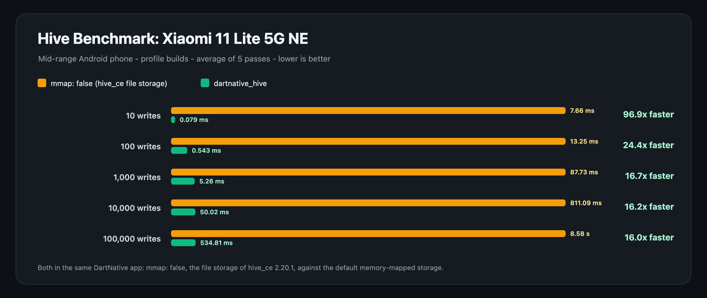
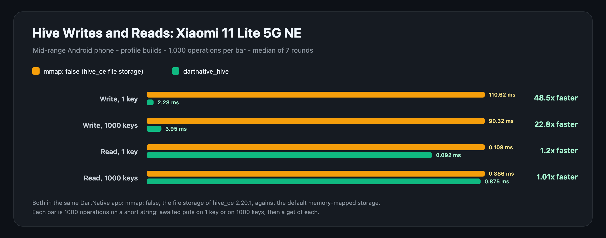

# Benchmark on Android

dartnative_hive on a mid-range Android phone, the Xiaomi 11 Lite 5G NE,
in a profile build of this example (`lib/benchmark_main.dart`). There is
no Flutter app beside it on this phone, so both bars are dartnative_hive in
the same DartNative app: `mmap: false`, hive_ce 2.20.1's own file storage,
against the default memory-mapped storage. On the iPhone, `mmap: false`
ran within a few percent of hive_ce in a Flutter app
([README.md](README.md)).

## hive_ce's benchmark



| Writes | mmap: false (ms) | dartnative_hive (ms) | dartnative_hive | Size (MB) |
| ---: | ---: | ---: | ---: | ---: |
| 10 | 7.656 | 0.079 | 96.9x faster | 0.00 |
| 100 | 13.251 | 0.543 | 24.4x faster | 0.01 |
| 1000 | 87.734 | 5.263 | 16.7x faster | 0.11 |
| 10000 | 811.086 | 50.018 | 16.2x faster | 1.10 |
| 100000 | 8581.175 | 534.807 | 16.0x faster | 10.97 |

## Writes and reads



Milliseconds for 1000 operations on a short string; lower is better.

| Operation | mmap: false (ms) | dartnative_hive (ms) | dartnative_hive |
| --- | ---: | ---: | ---: |
| Write, 1 key | 110.616 | 2.283 | 48.5x faster |
| Write, 1000 keys | 90.324 | 3.954 | 22.8x faster |
| Read, 1 key | 0.109 | 0.092 | 1.2x faster |
| Read, 1000 keys | 0.886 | 0.875 | 1.01x faster |

<details>
<summary>Every case: integers, booleans, 256-byte buffers, puts not awaited, one <code>putAll</code></summary>

| Case | mmap: false (ms) | dartnative_hive (ms) | dartnative_hive |
| --- | ---: | ---: | ---: |
| **Stored writes** | | | |
| string, every put awaited | 110.616 | 2.283 | 48.5x faster |
| string, every put awaited, 1000 keys | 90.324 | 3.954 | 22.8x faster |
| string, 1000 puts, last awaited | 79.017 | 1.834 | 43.1x faster |
| string, one putAll | 3.089 | 2.353 | 1.3x faster |
| integer, every put awaited | 88.881 | 1.714 | 51.9x faster |
| integer, every put awaited, 1000 keys | 75.653 | 3.313 | 22.8x faster |
| integer, 1000 puts, last awaited | 70.699 | 1.443 | 49.0x faster |
| integer, one putAll | 1.993 | 1.893 | 1.05x faster |
| boolean, every put awaited | 117.954 | 1.594 | 74.0x faster |
| boolean, every put awaited, 1000 keys | 79.748 | 3.116 | 25.6x faster |
| boolean, 1000 puts, last awaited | 73.729 | 1.414 | 52.1x faster |
| boolean, one putAll | 2.049 | 1.871 | 1.10x faster |
| buffer 256B, every put awaited | 112.467 | 4.453 | 25.3x faster |
| buffer 256B, every put awaited, 1000 keys | 86.049 | 6.164 | 14.0x faster |
| buffer 256B, 1000 puts, last awaited | 88.064 | 3.826 | 23.0x faster |
| buffer 256B, one putAll | 5.386 | 6.034 | 1.1x slower |
| **Writes not awaited** | | | |
| string, put not awaited | 0.808 | 1.664 | |
| string, put not awaited, 1000 keys | 2.110 | 3.287 | |
| integer, put not awaited | 0.737 | 1.329 | |
| integer, put not awaited, 1000 keys | 2.291 | 2.832 | |
| boolean, put not awaited | 0.851 | 1.192 | |
| boolean, put not awaited, 1000 keys | 2.502 | 2.679 | |
| buffer 256B, put not awaited | 0.760 | 3.634 | |
| buffer 256B, put not awaited, 1000 keys | 2.242 | 5.662 | |
| **Reads** | | | |
| string read | 0.109 | 0.092 | 1.2x faster |
| string read, 1000 keys | 0.886 | 0.875 | 1.01x faster |
| integer read | 0.068 | 0.089 | 1.3x slower |
| integer read, 1000 keys | 0.884 | 0.846 | 1.04x faster |
| boolean read | 0.103 | 0.092 | 1.1x faster |
| boolean read, 1000 keys | 1.052 | 0.871 | 1.2x faster |
| buffer 256B read | 0.145 | 0.072 | 2.0x faster |
| buffer 256B read, 1000 keys | 0.942 | 0.913 | 1.03x faster |

**Writes not awaited** do different work on each side, as in
[README.md](README.md): with `mmap: false` nothing is stored when the clock
stops, while the memory-mapped storage has already stored every value, so
these rows get no ratio.

Reads are the same code on both sides and take under a microsecond each,
so their rows move by a few hundredths of a millisecond from one run to the
next. The one slower write, a single `putAll` of 1000 256-byte buffers, is
within the run's spread (4.79 to 6.33 ms against 4.81 to 6.29 ms); the
file grows past its first 64 KiB on the way.

</details>

## A kill with no await

The example made 1000 `put` calls without awaiting them, then the app
killed its own process. At the next launch, the memory-mapped storage had
all 1000 values, three launches in a row; with `mmap: false`, none of them
were stored, three launches in a row. A box written by the memory-mapped
storage opens with `mmap: false`, with every value there.

Nothing is lost if the app crashes or is killed. A sudden loss of power is
the one case the system cannot cover; `await box.flush()` returns once the
data is on the phone's storage.

## Redrawing the charts

```
dart run tool/generate_benchmark_chart.dart hive-ce benchmarks/android.md \
  benchmarks/android_hive_ce_benchmark.svg "Xiaomi 11 Lite 5G NE" \
  "Mid-range Android phone - profile builds - average of 5 passes - lower is better" \
  --baseline=mmap-false
dart run tool/generate_benchmark_chart.dart writes-and-reads benchmarks/android.md \
  benchmarks/android_writes_and_reads.svg "Xiaomi 11 Lite 5G NE" \
  "Mid-range Android phone - profile builds - 1,000 operations per bar - median of 7 rounds" \
  --baseline=mmap-false
```
