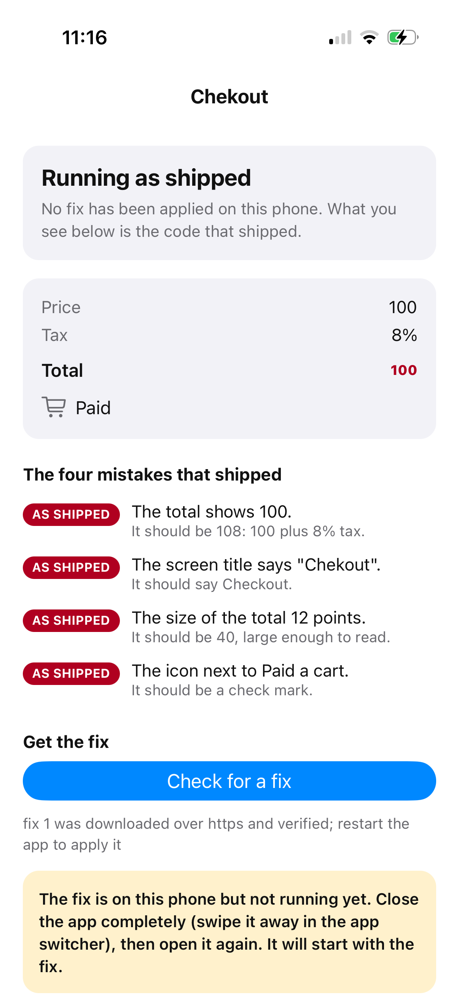
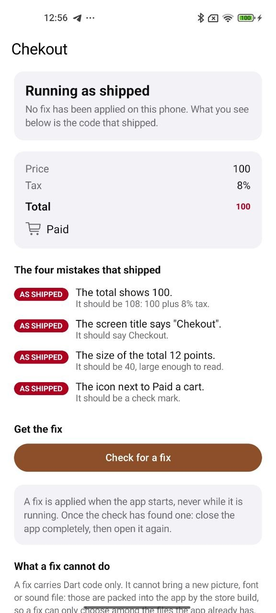
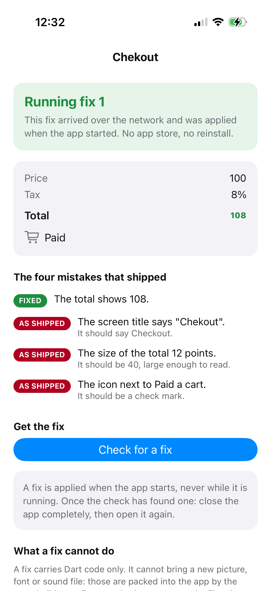
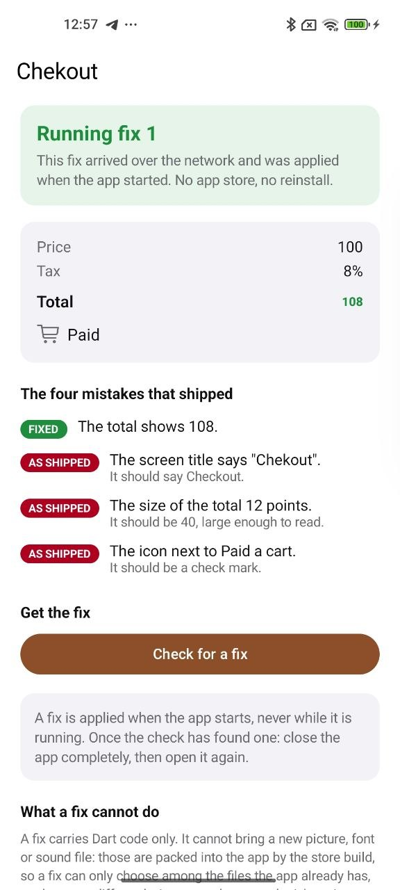
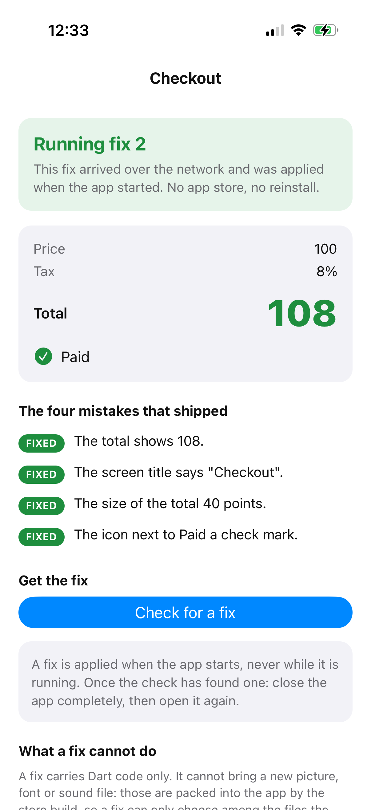
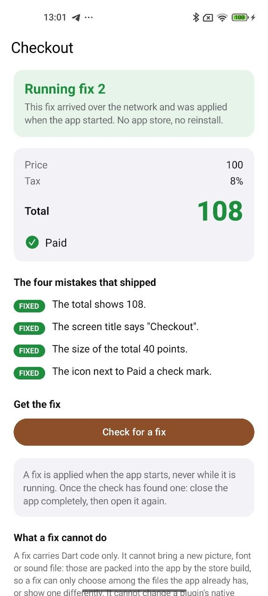

# Code push: send a fix straight to phones

Send a fix directly to phones, without a release to App Store and Google Play.
Every plan has it.

> **Read this first.** Code push is experimental. The two commands refuse
> to run until you opt in (see Before you start).

This app ships four deliberate mistakes: a total that forgets the tax, a
typo in the screen title, a total drawn far too small, and the wrong icon
next to "Paid". You release it, install it on a phone, fix the mistakes in
one file, and send the fixes with `dn patch`. The phone downloads them,
and the next time the app starts it is correct: no app store, no
reinstall. The screen labels each mistake as it goes from AS SHIPPED to
FIXED, and shows what the app reported when it started, so you can see
exactly what happened.

It takes about 20 minutes, most of it build time.

## Before you start

- **The `dn` command** installed, and a phone or emulator: a real iPhone
  (release builds do not run on the iOS Simulator), or an Android phone or
  emulator. See the getting started guide in the docs folder.
- **Your licence key**, configured once:

  ```sh
  dn config --license-key dnk_...
  ```

  Code push needs your own account: `dn release` and `dn patch` register
  what they build with the update service under it, and a phone can only
  download a fix after the daily licence check your key allows. This app
  is not covered by the free demo licence; every build you make carries
  the key you configured.
- **Opt in to the experiment**, in the shell you will use for every
  command below:

  ```sh
  export DN_CODE_PUSH_EXPERIMENTAL=1
  ```

  Without it, `dn release` and `dn patch` stop with "Code push is not
  available yet".
- **Change the app id to one of your own**, on both platforms, before you
  run `dn release`. An app id belongs to the first account that ships it,
  so the id this tutorial comes with cannot work for everyone who tries
  it. Put your own name or domain in it, for example
  `com.yourname.codepushtutorial`. While the app still has the id it comes
  with, a yellow card at the top of its screen reminds you; the card goes
  away once the id is yours.
  - **iPhone:** open `ios/Runner.xcworkspace` in Xcode once, and under
    Signing & Capabilities pick your team and set the bundle identifier. A
    free Apple ID is enough.
  - **Android:** set `applicationId` in `android/app/build.gradle.kts`.

## The app, in three files

- `lib/fix_me.dart`: the four mistakes, each a small function that returns
  a plain value. **This is the only file you edit.**
- `lib/checkout_screen.dart`: the screen. It reads the four values while it
  draws and never changes. A fix reaches every caller of a fixed function,
  so a screen that never changed still shows the corrected values.
- `lib/main.dart`: only `main()`. It registers the platform bindings and
  starts the app. Code push needs no line of its own: `runApp` applies a
  fix the previous run downloaded before the first screen, and checks for
  a newer one once the screen is up.

Why the mistakes are plain values and not widgets: today a fix may build
only a handful of framework widgets (`Text`, `Column`, `Row`, `SizedBox`,
`Padding`, `Center`, `Container`, `EdgeInsets.all` and `Color`), and it may
not create an instance of any class declared in the file it changes.
Numbers, text and true/false keep every fix inside those rules; the screen
turns them into widgets. The comments in `fix_me.dart` say more.

## Step 1: See the mistakes (optional)

```sh
dn pub get
dn run
```

The title reads "Chekout", the total is a tiny red 100 under "Tax 8%", the
icon next to Paid is a shopping cart, and all four rows say AS SHIPPED. If
you have not changed the app id yet, a yellow card at the top says so.
Code push does nothing in a debug run like this one: the button at the
bottom says so when you tap it. Stop `dn run` before the next step.

On Android, uninstall this debug build before you install the release,
because the two are signed differently:

```sh
adb uninstall <your application id>
```

## Step 2: Make the release

```sh
dn release ios        # or:  dn release android
```

This builds the app in release mode and remembers everything a later fix
needs. It ends with:

```
✓ Released 1.0.0+1
  ...
Ship this build. When you need to fix something in it:
  dn patch ios
```

Two things appear in the project. Keep the first in version control, as
the file itself says; the second is machine-local and already listed in
`.gitignore`:

- `dn_code_push.yaml`: the app's own id, the release version (`1.0.0+1`,
  so a fix built for another release is left alone) and the address where
  this release asks about fixes. `dn release` also adds it to the app's
  assets in `pubspec.yaml`, so the installed app carries it.
- `.dn_code_push/`: the recorded release, and on Android the release app
  itself. Every fix is the difference from exactly this, so only this
  machine can send fixes for this release.

## Step 3: Put the release on the phone

**Android.** `dn release android` keeps the release app with the recorded
release, and that is the one to install:

```sh
adb install -r .dn_code_push/apps/android/1.0.0+1/app-release.apk
```

Open it from the launcher.

**iPhone.** `dn release ios` builds without signing, so install with
`dn run`, and hand it the same list of fixable functions the release used:

```sh
dn run -d <your iPhone> --release \
  --extra-front-end-options=--dynamic-interface=$PWD/.dn_code_push/blocks/ios/1.0.0+1/build_iface.yaml
```

(`dn devices` lists the ids.) The long option matters: it marks every
function as fixable, exactly as the release build did. A plain
`dn run --release` installs an app that looks the same but ignores fixes.
The tool does not yet do this for you. Once the app is up you can stop
`dn run`; if that closes the app, open it again from the home screen.

**What you should see**, on either platform: the same screen as in step 1,
"Running as shipped" at the top, and under "What the app reported when it
started" a line saying no fix was applied.

iPhone on the left, Android on the right:

<p>
  
  
</p>

From here on, do not run `dn run` again for this app: it would reinstall a
build with your later edits compiled in, and there would be nothing left to
fix.

## Step 4: Fix the number and send it

In `lib/fix_me.dart`, make `priceWithTax` add the tax:

```dart
int priceWithTax(int cents) {
  return cents + (cents * 8) ~/ 100;
}
```

Then:

```sh
dn patch ios          # or:  dn patch android
```

On iPhone it prints, in well under a minute:

```
✓ Fix 1 is live for 1.0.0+1
  4 functions to swap over, each in its own module
  module_1.bytecode: priceWithTax, 615 bytes ...
  ...
Phones pick it up at their next check and apply it at the launch after.
```

Four functions, not one: a fix carries every function of a file it
changes, the three you did not touch included. They behave exactly as
before. On Android the fix is a small binary difference instead, one per
processor type, and the message names those.

## Step 5: Let the phone pick it up

Nobody has to tap anything for this. Every time the app starts, right after
its screen comes up, it asks whether a fix is waiting and downloads it in
the background, ready for the next start.

Close the app completely (open the app switcher and swipe it away; putting
it in the background is not enough), open it again, and give it a few
seconds. At the bottom of the screen, under "What the app's own check
found", the line should read

```
fix 1 was downloaded over https and verified; restart the app to apply it
```

Nothing else changes: the total is still 100. A fix is never applied to an
app that is already running.

To watch a check happen, tap **Check for a fix**: it asks again and shows
the answer under the button. Once the app's own check has downloaded the
fix, the button's answer is

```
fix 1 is already downloaded, restart the app to apply it
```

If a line says the phone has not completed its daily licence check yet, the
app is still exchanging your key for the day's pass, which it does in the
background right after it starts: wait a few seconds and tap Check for a
fix, or start the app again. If it says it could not check for fixes, the
phone has no network.

## Step 6: Restart, and watch it correct itself

Close the app completely (open the app switcher and swipe it away; putting
it in the background is not enough), then open it again.

**What you should see:** "Running fix 1" at the top, the total now 108 in
green with a FIXED tag, and the other three rows still AS SHIPPED. Under
"What the app reported when it started", on iPhone, a line counting the
functions attached (4 attached, 0 failed) and one saying the first screen
is up and fix 1 is confirmed good; on Android, "fix 1 applied at launch
(android updater)". The app's own check now says fix 1 is already
running.

<p>
  
  
</p>

## Step 7: Fix the other three

In `lib/fix_me.dart`, make the remaining three functions return
`'Checkout'`, `40` and `'check'` (each has the line in its comment), then
`dn patch` again. The service numbers it fix 2. On the phone: close and
reopen the app, give it a few seconds to download fix 2 by itself, then
close and reopen it once more. Now the title reads "Checkout", the total is
large, the icon is a check mark, all four rows say FIXED, and the top says
"Running fix 2".

<p>
  
  
</p>

Fix 2 replaced fix 1. A phone holds one fix per release, and that fix
carries everything that differs from the release; you never have to send
fixes in order or worry about one stacking on another.

## What you have seen

- **The phone fetches a fix by itself.** The first start after you send
  it downloads it; the start after that applies it. The button only lets
  you watch.
- **A fix applies at the next full launch**, never during a session.
- **Release builds only.** A debug run does not take part.
- **A fix reaches every caller.** The screen that shows the values never
  changed and never knew about the fix.
- **Only your own Dart code can be fixed**, and only what it does, not its
  shape: change what a function returns, not its name or type.
- **On Android** a fix is ordinary compiled code and runs at full speed.
  **On iPhone** only the functions a fix changes run in an interpreter,
  the way a React Native app runs all of its code, all the time. So a
  fixed function runs like React Native code, and the rest of your app
  keeps running compiled, at full speed. A fix usually changes a few small
  functions, so the app as a whole stays fast. Your next store release
  compiles the fixed code in, and it runs at full speed too.

## What a fix cannot do

Each of these was tried on this app, and `dn patch ios` refused it before
anything was sent:

- **Change a function's type.** Making `priceWithTax` return a `double` is
  refused with "it changes the shape of the released code".
- **Add a class to the file you changed** and use it. Refused; today the
  refusal is the compiler's own wording ("Cannot invoke constructor ...
  from a dynamic module"). Put a new class in its own, unchanged file, or
  ship a release.
- **Build widgets outside the small allowed set.** A `TextStyle` or an
  `Icon` in the changed file is refused ("Cannot use class 'TextStyle' in a
  dynamic module"). That is why the screen, not `fix_me.dart`, turns the
  icon's name into an icon.
- **Bring a new picture, font or sound file.** A fix carries Dart code
  only. Files are packed into the app by the store build, so a fix can
  choose among the files the app already has, or show one differently, but
  cannot add one. The same goes for a plugin's native code and for the
  framework itself.

And one thing a fix may do: **add a new function**. A new top-level
function or static method in the file you change travels inside the fix,
and a fixed function in that same file can call it; the phone keeps it
as it came, since the installed app has no function by that name to
replace. Adding a method to a class the app was released with is refused,
like adding a class.

## If something does not look right

- **"Code push is not available yet"**: export `DN_CODE_PUSH_EXPERIMENTAL=1`
  in this shell.
- **"The update service does not recognise this licence key"**: run
  `dn config --license-key` again with the key from your account.
- **A line says the app's id belongs to another DartNative account**: the
  id this tutorial comes with was left in place (the yellow card is then at
  the top of the screen), or you used an id someone else already released.
  The app keeps running, but gets no fixes. Set an id of your own on both
  platforms (see Before you start), make a new release from step 2 and
  install it again.
- **The phone never changes after a restart (iPhone)**: you probably
  installed with a plain `dn run --release`. Delete the app from the phone
  and install again with the command in step 3.
- **"fix N was built for another framework revision"** in the line under
  the button: the app on the phone and the tool that built the fix come
  from different DartNative builds. Update the SDK, make a new release, and
  start again from step 2.
- **"This app was released with a different DartNative than you have
  now"** from `dn patch`: the SDK changed since the release. Make a new
  release.
- **`adb install` fails with a signature message**: a debug build is
  installed. `adb uninstall <your application id>` first.
- **Taking a fix down**: every fix you sent has a
  `.dn_code_push/patches/<platform>/1.0.0+1/<n>/server.json` with its
  `patch_id`. One request with your licence key withdraws it. Phones that
  already have it remove it at their next start, and the start after that
  runs the newest fix you have not withdrawn, or the release as shipped:

  ```sh
  curl -X POST -H "Authorization: Bearer dnk_..." \
    https://api.dartpub.dev/v1/code-push/patches/<patch_id>/withdraw
  ```

This walkthrough was written on a Mac. On Windows the Android commands are
expected to work the same way, but that has not been walked yet.
